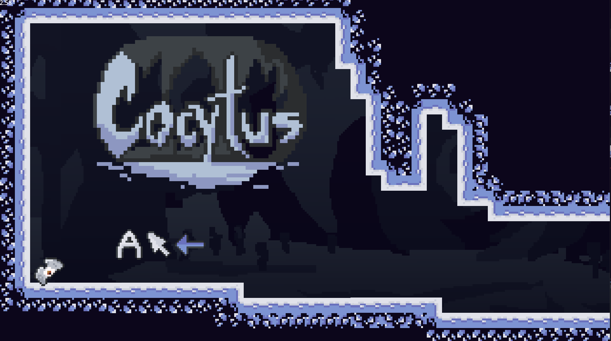
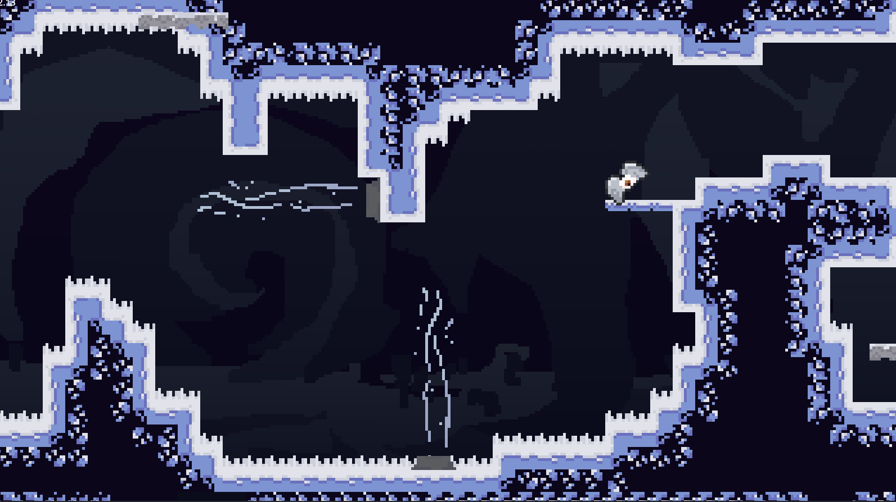
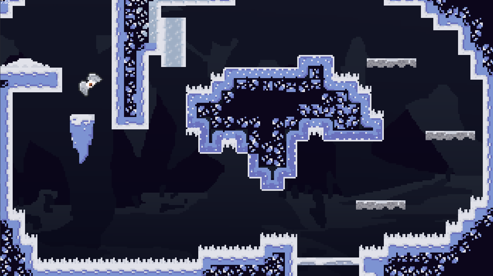
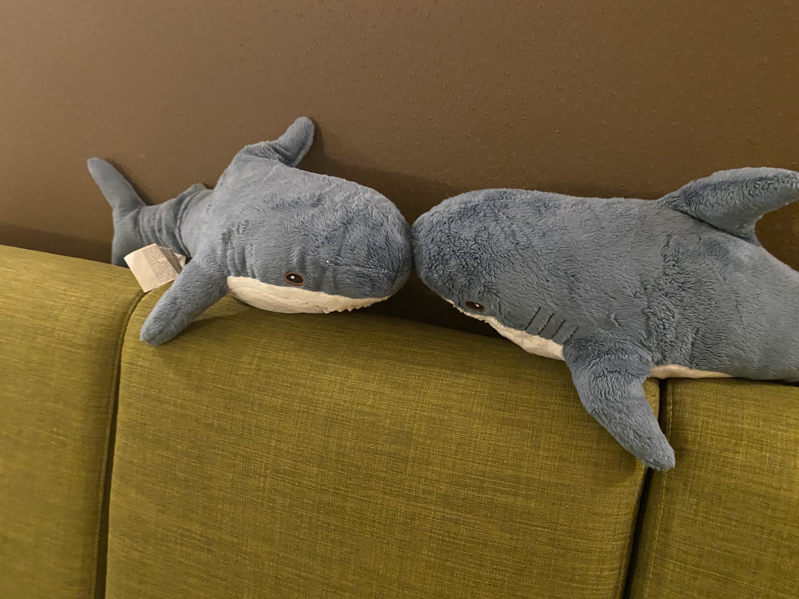
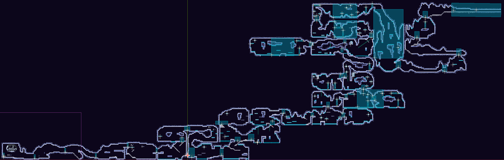

# Cocytus

**Cocytus** is an indie platformer with a twist:  
you move not with WASD, but with your **mouse**, using its position relative to the player to determine direction.

Built with 💜 for [Hack Club Juice](https://github.com/hackclub/juice) over the course of 2 months for a gamejam in Shanghai :3

Playable on **web** via [Itch.io](https://idksarah.itch.io/wild-wild-wait-what)  
Steam build coming soon™

---

## Photos/Gameplay

##### Gameplay screenshot 1

##### Gameplay screenshot 2

##### Gameplay screenshot 3

##### Blahajs in Shanghai

##### Map

##### Logo
---

## Built With

- [Godot 4](https://godotengine.org/)
- [Piskel](https://www.piskelapp.com/)

---

## Running the Game Locally

1. Download [Godot 4](https://godotengine.org/download)
2. Clone this repo
3. Open the project in the Godot project manager
4. Press Play or Build to run/edit the game

## Questions?
Comment on the Itch page or open an issue. I check both sometimes :^)
> Camera movement between rooms is a known (and painful) bug. If you’ve got ideas for fixing it, DM me or drop a comment on Itch.

## License
MIT or whatever. I guess.
